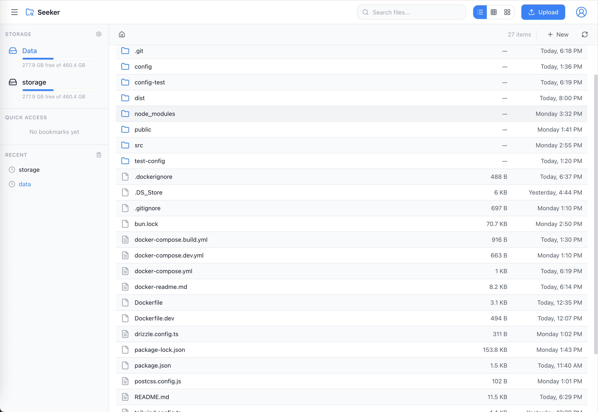

# Seeker

A modern, native-feeling web-based file browser for home servers. Seeker provides a familiar file management experience similar to macOS Finder or Windows Explorer, accessible from any device through your browser.



## Features

### File Management

- **Browse & Navigate** - Intuitive folder navigation with breadcrumbs and back/forward history
- **Multiple Views** - List, thumbnail grid, and card views for different browsing preferences
- **File Operations** - Copy, move, rename, delete files and folders with conflict resolution
- **Batch Operations** - Select multiple files for bulk operations
- **Upload Support** - Drag-and-drop uploads with progress tracking
- **Folder Uploads** - Upload entire directories while preserving structure
- **Download** - Single or multiple file downloads
- **Built-in Text Editor** - Edit text files directly with syntax highlighting for JSON, YAML, YML, ENV, and more

### Authentication & Security

- **Multi-user Support** - Create multiple user accounts with role-based access
- **Admin Controls** - Admin users can manage mounts and other users
- **Secure Sessions** - HTTP-only cookie authentication with Argon2id password hashing
- **First-run Setup** - Guided setup for first-time installation

### User Interface

- **Native Feel** - Designed to feel like a desktop file manager
- **Context Menus** - Right-click context menus for quick actions
- **Selection Modes** - Click, Ctrl+Click, Shift+Click, and lasso selection
- **Dark/Light Theme** - Theme support with CSS variables for easy customization
- **Responsive Design** - Works on desktop, tablet, and mobile devices

### Organization

- **Bookmarks** - Pin frequently accessed folders for quick access
- **Recent Locations** - Track recently visited directories
- **Virtual Folders** - Build collections of files from multiple mounts without moving them
- **Search** - Search files by name with optional recursive search
- **Sorting** - Sort by name, date, size, or type (ascending/descending)
- **Hidden Files** - Toggle visibility of hidden files (dotfiles)

### Media Support

- **Image Preview** - View images in original size with zoom in/out controls
- **Video Player** - Built-in video player with full playback controls and streaming support
- **Next/Previous Navigation** - Browse through images and videos using keyboard arrows or on-screen controls
- **Image Thumbnails** - Automatic thumbnail generation for images
- **PDF Thumbnails** - Automatic thumbnail generation for PDF documents
- **Thumbnail Caching** - Cached thumbnails in separate database for performance
- **Supported Formats** - Images: JPEG, PNG, GIF, WebP, SVG | Videos: MP4, WebM, MOV

### Storage Management

- **Multiple Mounts** - Configure multiple storage locations
- **Storage Stats** - View used/free space for each mount
- **Mount Management** - Admin-only mount configuration

## Key Features Explained

### Built-in Text Editor

Seeker includes a powerful CodeMirror-powered text editor with syntax highlighting:

- **Supported Formats**: JSON, YAML, YML, ENV, TXT, MD, JS, TS, JSX, TSX, CSS, HTML, XML, and more
- **Syntax Highlighting**: Language-specific highlighting for better code readability
- **Direct Editing**: Edit files in-place without downloading
- **Direct-save**: Changes are saved directly to your files
- **Line Numbers**: Easy navigation with line numbering

Simply click on any text file to open it in the editor.

### Virtual Folders

Create smart collections without duplicating files:

- **Cross-Mount Collections**: Add files and folders from any mount into a single virtual folder
- **Non-Destructive**: Items stay in their original locations; virtual folders store references only
- **Flexible Management**: Create, rename, reorder, and delete collections without touching your filesystem
- **Easy Adding/Removing**: Use multi-select actions or context menus to manage membership quickly

### Image Preview

View your images with advanced preview capabilities:

- **Full-Size Viewing**: See images in their original resolution
- **Zoom Controls**: Zoom in and out for detailed inspection
- **Pan Support**: Navigate around zoomed images
- **Next/Previous Navigation**: Quickly browse through images using keyboard arrows or on-screen controls
- **Supported Formats**: JPEG, PNG, GIF, WebP, SVG, and more
- **Fast Loading**: Optimized image delivery
- **Seamless Browsing**: Navigate through all images in a folder without returning to the file list

### Video Player

Watch your videos with a professional video player powered by Vidstack:

- **Built-in Playback**: Play videos directly in your browser without downloading
- **Full Controls**: Play, pause, seek, volume, fullscreen, and picture-in-picture
- **Streaming Support**: Efficient range request streaming for smooth playback and seeking
- **Format Support**: MP4, WebM, MOV (QuickTime), and other browser-supported formats
- **Keyboard Shortcuts**: Space to play/pause, arrow keys for seeking, M to mute, F for fullscreen
- **Next/Previous Navigation**: Browse through all videos in a folder seamlessly
- **Mobile-Friendly**: Touch gestures and inline playback on mobile devices
- **Quality Auto-Detection**: Automatic format compatibility warnings for unsupported codecs
- **Volume Persistence**: Remembers your volume preference across videos

### PDF Support

Handle PDF documents with ease:

- **Thumbnail Generation**: Automatic thumbnail creation for PDF files
- **Fast Access**: Efficiently browse folders containing PDF documents

## Tech Stack

### Backend

| Technology                               | Purpose                              |
| ---------------------------------------- | ------------------------------------ |
| [Bun](https://bun.sh)                    | JavaScript runtime & package manager |
| [Elysia.js](https://elysiajs.com)        | Fast, type-safe web framework        |
| [Drizzle ORM](https://orm.drizzle.team)  | Type-safe SQL ORM                    |
| [SQLite](https://sqlite.org)             | Lightweight embedded database        |
| [Sharp](https://sharp.pixelplumbing.com) | High-performance image processing    |

### Frontend

| Technology                               | Purpose               |
| ---------------------------------------- | --------------------- |
| [React 19](https://react.dev)            | UI framework          |
| [TypeScript](https://typescriptlang.org) | Type safety           |
| [Zustand](https://zustand-demo.pmnd.rs)  | State management      |
| [TailwindCSS](https://tailwindcss.com)   | Utility-first CSS     |
| [Vidstack](https://vidstack.io)          | Video player          |
| [CodeMirror](https://codemirror.net)     | Code editor component |
| [Lucide Icons](https://lucide.dev)       | Beautiful icons       |
| [React Router](https://reactrouter.com)  | Client-side routing   |

### Build & Deploy

| Technology                   | Purpose             |
| ---------------------------- | ------------------- |
| [Vite](https://vitejs.dev)   | Frontend build tool |
| [Docker](https://docker.com) | Containerization    |

## Prerequisites

- [Docker](https://docker.com) and [Docker Compose](https://docs.docker.com/compose/) (recommended)
- OR [Bun](https://bun.sh) 1.0+ for local development

## Quick Start with Docker

### 1. Create docker-compose.yml

```yaml
services:
  seeker:
    image: ipradeepmishra/seeker:latest
    container_name: seeker
    restart: unless-stopped
    ports:
      - "7335:3000"
    volumes:
      # Configuration and database storage
      - ./config:/config
      # Mount your storage directories
      - /path/to/your/files:/data
      # Add more mounts as needed
      # - /mnt/storage:/storage
    environment:
      - UID=1000 # optional, default is 1000
      - GID=1000 # optional, default is 1000
```

### 2. Start the Container

```bash
docker compose up -d
```

### 3. Access Seeker

Open your browser and navigate to `http://{Docker Address}:7335`

On first access, you'll be prompted to create an admin account.

## Local Development

### 1. Clone the Repository

```bash
git clone https://github.com/yourusername/seeker.git
cd seeker
```

### 2. Install Dependencies

```bash
bun install
```

### 3. Start Development Servers

```bash
# Start both backend and frontend in development mode
bun run dev

# Or start them separately:
bun run dev:server  # Backend on http://localhost:3000
bun run dev:client  # Frontend on http://localhost:5173
```

Open your browser and navigate to `http://localhost:5173`

### 4. Build for Production

```bash
bun run build
```

## Configuration

### Environment Variables

| Variable        | Default       | Description                               |
| --------------- | ------------- | ----------------------------------------- |
| `PORT`          | `3000`        | Server port                               |
| `HOST`          | `0.0.0.0`     | Server host                               |
| `NODE_ENV`      | `development` | Environment mode                          |
| `CONFIG_PATH`   | `/config`     | Path to store databases and config        |
| `DEFAULT_MOUNT` | -             | Auto-configure this path as default mount |

### Docker Volumes

| Path          | Purpose                                                  |
| ------------- | -------------------------------------------------------- |
| `/config`     | **Required** - Stores SQLite databases and configuration |
| `/data`       | Optional - Default data mount point                      |
| Custom mounts | Add your own storage directories                         |

### Database Files

Seeker uses two SQLite databases stored in the config directory:

- `main.db` - Users, sessions, settings, bookmarks, mounts, recent locations
- `thumb.db` - Cached image thumbnails (can be deleted to regenerate)

## API Reference

### Authentication

| Method | Endpoint             | Description          |
| ------ | -------------------- | -------------------- |
| GET    | `/api/auth/status`   | Check if users exist |
| POST   | `/api/auth/register` | Register new user    |
| POST   | `/api/auth/login`    | Login                |
| POST   | `/api/auth/logout`   | Logout               |
| GET    | `/api/auth/me`       | Get current user     |
| PATCH  | `/api/auth/password` | Change password      |

### Files

| Method | Endpoint               | Description                     |
| ------ | ---------------------- | ------------------------------- |
| GET    | `/api/files`           | List directory contents         |
| GET    | `/api/files/search`    | Search files                    |
| GET    | `/api/files/download`  | Download file                   |
| GET    | `/api/files/stream`    | Stream video with range support |
| GET    | `/api/files/read`      | Read text file content          |
| GET    | `/api/files/thumbnail` | Get image thumbnail             |
| POST   | `/api/files/upload`    | Upload files                    |
| POST   | `/api/files/write`     | Write text file content         |
| POST   | `/api/files/folder`    | Create folder                   |
| POST   | `/api/files/rename`    | Rename file/folder              |
| POST   | `/api/files/copy`      | Copy files                      |
| POST   | `/api/files/move`      | Move files                      |
| DELETE | `/api/files`           | Delete files                    |

### Mounts (Admin Only)

| Method | Endpoint                | Description       |
| ------ | ----------------------- | ----------------- |
| GET    | `/api/mounts`           | List all mounts   |
| POST   | `/api/mounts`           | Add mount         |
| DELETE | `/api/mounts/:id`       | Remove mount      |
| GET    | `/api/mounts/:id/stats` | Get storage stats |

### Bookmarks

| Method | Endpoint                 | Description       |
| ------ | ------------------------ | ----------------- |
| GET    | `/api/bookmarks`         | List bookmarks    |
| POST   | `/api/bookmarks`         | Add bookmark      |
| DELETE | `/api/bookmarks/:id`     | Remove bookmark   |
| PATCH  | `/api/bookmarks/reorder` | Reorder bookmarks |

### Settings

| Method | Endpoint        | Description      |
| ------ | --------------- | ---------------- |
| GET    | `/api/settings` | Get all settings |
| PATCH  | `/api/settings` | Update settings  |

## Theming

Seeker uses CSS custom properties for theming. You can customize the appearance by modifying the variables in `src/client/styles/index.css`:

```css
:root {
  /* Primary colors */
  --color-primary-500: #3b82f6;

  /* Surface colors */
  --color-surface: #ffffff;
  --color-surface-secondary: #f9fafb;

  /* Content colors */
  --color-content: #111827;
  --color-content-secondary: #4b5563;

  /* Accent colors */
  --color-accent: #3b82f6;

  /* And more... */
}
```

## Project Structure

```
seeker/
├── src/
│   ├── server/                 # Backend code
│   │   ├── db/                 # Database schema and connection
│   │   ├── middleware/         # Auth middleware
│   │   ├── routes/             # API routes
│   │   ├── services/           # Business logic
│   │   └── utils/              # Utilities
│   └── client/                 # Frontend code
│       ├── components/         # React components
│       │   ├── common/         # Shared components
│       │   ├── dialogs/        # Modal dialogs
│       │   ├── files/          # File browser components
│       │   └── layout/         # Layout components
│       ├── hooks/              # Custom hooks
│       ├── lib/                # API client and utilities
│       ├── pages/              # Page components
│       ├── stores/             # Zustand stores
│       └── styles/             # CSS styles
├── public/                     # Static assets
├── config/                     # Runtime config (gitignored)
├── Dockerfile                  # Production Docker image
├── docker-compose.yml          # Docker Compose config
└── package.json
```

## Security Considerations

- **Password Hashing**: Argon2id with secure parameters
- **Session Management**: HTTP-only cookies with 30-day expiry
- **Path Validation**: Strict path validation to prevent directory traversal
- **Mount Restrictions**: File operations limited to configured mounts
- **CORS**: Configured for production use
- **Non-root Docker**: Container runs as non-root user

## Troubleshooting

### Common Issues

**Mount not accessible**

- Ensure the path exists and has correct permissions
- Check Docker volume mappings

**Thumbnails not generating**

- Verify Sharp is installed correctly
- Check `/config/thumb.db` permissions

**Login issues**

- Clear browser cookies and try again
- Check `/config/main.db` exists

### Logs

```bash
# View container logs
docker logs seeker

# Follow logs in real-time
docker logs -f seeker
```

## Contributing

Contributions are welcome! Please feel free to submit a Pull Request.

1. Fork the repository
2. Create your feature branch (`git checkout -b feature/amazing-feature`)
3. Commit your changes (`git commit -m 'Add some amazing feature'`)
4. Push to the branch (`git push origin feature/amazing-feature`)
5. Open a Pull Request

## License

No Licence

## Acknowledgments

- [Lucide](https://lucide.dev) for the beautiful icons
- [TailwindCSS](https://tailwindcss.com) for the utility-first CSS framework
- [Elysia.js](https://elysiajs.com) for the blazing fast backend framework

---

<p align="center">
  Made with ❤️ for home server enthusiasts
</p>
